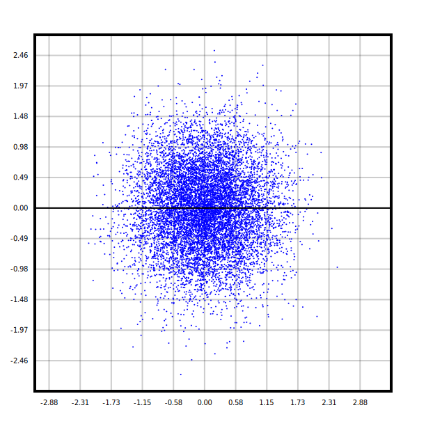

# zigThingsAreHappening

## Installation

You will need to have zig 13.0 on your machine!
find how to download it at [https://ziglang.org/download/](https://ziglang.org/download/)

First, clone this repository:

<!-- start:code block -->

# Clone this repository

git clone https://github.com/AngelosLeEpic/zigThingsAreHappening.git
cd zigThingsAreHappening

# Run the app

zig build run -Doptimize=ReleaseFast -- <possible test>

<!-- end:code block -->

replace `<possible test>` with one of the following: `testPoisson`, `testPoissonPDF`, `testPoisson1D`, `testQuantPoisson`, `testNormal`, `testNormal1D`, `testQ1`, `testQ2`, `testDistClasses`, `testQuant`

## Q1 Examples

### Our Contributors ✨

